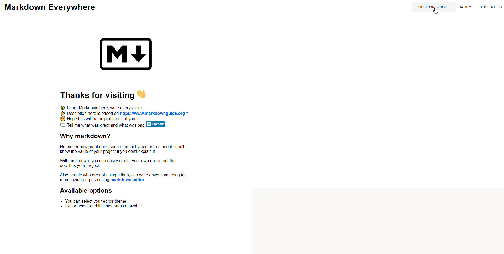

# Markdown - Everywhere 

 

click [here](https://markdown-everywhere.web.app/) to see the live demo

If you find a bug or great idea about this app, feel free to contact [me](https://www.linkedin.com/in/dh-kim-733227200/)

 

## Index

[1. What is Markdown - Everywhere](#What-is-Markdown---Everywhere)  
[2. Why did i make Markdown - Everywhere](#Why-did-i-make-Markdown---Everywhere)  
[3. Detail](#Detail)  
[4. What did i use here?](#What-did-i-use-here?)

 

### What is Markdown - Everywhere?

Markdown - Everywhere is a markdown practice web application that basically consist of three main element, description section, code editor section and markdown preview section.

I named this app as Markdown - Everywhere since i wanted to users write markdown everywhere after they learn it from here.

 

### Why did i make Markdown - Everywhere

- No matter how great open source project developers created, people won't know the value of project if they can't explain it with well organized document.

- Non-developers also can easily learn markdown and can use it to record something important with markdown editor.

- These are why i thought this is gonna be great if i deploy this app and let people learn about markdown.

 

### Detail

#### Introduction page

`There's some informative text about Markdown - Everywhere app`

 

#### Theme options

`There's few different code editor theme that user can select`

 

#### Resizing is available

`Users can resize sidebar width or code editor height`

 

#### Various tutorials

`Users can learn basic and extended markdown syntax by clicking the subject that they want to learn`

 

#### rendering output

`Output is immediately rendered on the preview section as soon as user enter some text`

 

### What did i use here?

- Development STACK

  
 
   

    
    
    
  

 

- NPM package

  1. [marked](https://www.npmjs.com/package/marked) (preview section)  
     As i needed to show users the output of Markdown, i used marked which is basically parse the text in the code editor into Markdown.

  2. [react-codemirror2](https://www.npmjs.com/package/react-codemirror2) (code editor section)  
     At first, i used textarea tag for code editor section, However, i thought that it was not great for user experience since it doesn't provide syntax highlight and other useful ability like entering tab key.
     That is why i used react-codemirror2 here.

  3. [re-resizable](https://www.npmjs.com/package/re-resizable) (sidebar and code editor)  
     While i was using this app to test, i felt uncomfortable about the size of sidebar and code editor. Sometimes i needed to use large size code editor and sidebar, but, sometimes i don't. So i implemented re-resizable for flexible size.

   

- Web API

  1. localStorage  
     For better user experience, this app has to remember user's current settings like size and theme and text that users wrote in the code editor. So i implemented localStorage and put these data into it.
